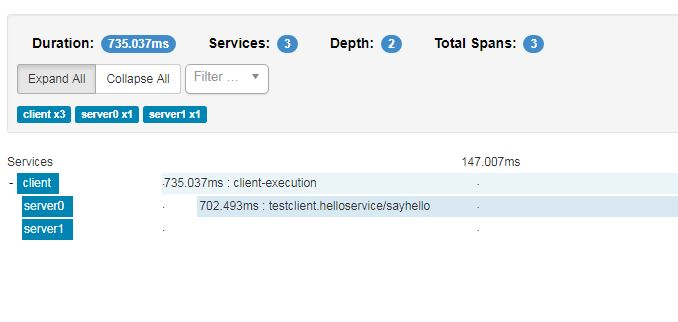

- First do a `clien install` to generate the protobuf definitions
- Easiest is to load up the project in intellij to run the main classes
- Execute `StartClientServerTogether`, it generates a root span with name 'client-execution' containing both server calls. Note you need to stop execution manually before starting the next case.   

- Execute `StartServers`, and then `StartClient` (i.e. both are in a different VM instance) the root span 'client-execution' is no longer created
